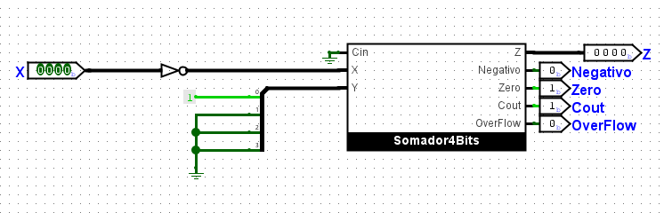

# EEL480 - Relatório do Projeto de Laboratório de Sistemas Digitais - 2023.1

## Integrantes
> Aline Capucho

> Afonso Mateus Pinto

> Juliana Dal Piaz

> Renan Carvalho Gomes

## Conteúdo
1. [Requisitos](#requisitos)
1. [Primeiros Testes](#primeiros-testes)
1. [Projeto](#projeto)
1. [Modularização](#modularização)
1. [Simulação](#simulação)
1. [Anexo A - Quartus passo a passo](#anexo-a)

## Requisitos
Nessa seção está resumido os requisitos levantados pelo professor. [Nesse arquivo](https://drive.google.com/file/d/10McyMFGa_nt-QEZUU1d6XBJOWCV4qwds/view) está tudo bem descrito e organizado.

### Objetivo do trabalho:
Os alunos devem desenvolver uma ULA (Unidade Lógica e Aritmética) de 4 bits e 8 operações, das quais 4 são obrigatórias e 4 escolhidas pelo trio.

### Especificações:
- As operações a serem executadas na ULA devem selecionada por entradas de controle. O
trabalho deve ter 3 chaves externas (switchers) para controlar tais operações.
- Operações obrigatórias: soma, subtração em complemento de 2, incremento +1, troca de
sinal.
- Os alunos deverão de desenvolver um módulo auxiliar que vai servir para variar os operandos
de entrada que testarão a ALU.
- Os dados de entrada e o resultado da operação devem ser exibidos nos LEDs disponíveis na
placa FPGA.
- As saídas da ALU deve ser o resultado e as quatro flags (Zero, negativo, carry out, overflow)
que deverão ser mostrados no LEDs.

### Funcionamento:
1. Os operandos de entrada são gerados por um módulo auxiliar que conterá um contator que percorrerá todos os binários representados por 4 bits. As entradas são mostradas simultaneamente nos LEDs. Em seguida, a ALU recebe os operandos e produz o resultado também mostrado no display de 7 segmentos. Além disso, a ALU gera 4 flags que são mostradas nos LEDs.
1. As entradas da ULA são geradas por um módulo auxiliar, um contador, parte integrante do projeto. As duas entradas são mostradas, juntamente com o resultado, nos displays de 7 segmentos disponíveis. Os LEDs são utilizados para mostrar as quatro “flags”. Os operandos vão mudando, em ordem crescente, a cada 2 segundos.


## Primeiros Testes
Nessa seção apresentaremos os passos necessários para configurar os ambientes de desenvolvimento, compilação e testes, tanto em casa quanto no laboratório.

### Configuração de Ambiente no Laboratório

**Nome do Simulador: ISE Simulator (ISim)**
[Link para site Xilinx](https://www.xilinx.com/products/design-tools/isim.html)

> Abrir um projeto novo
- Criar projeto sem template adicionando as características da placa;
    - Family: Spartan3AN 
    - Device: XC3S700AN
    - Package: FGG484
    - Preferred Language: VHDL
- Criar novo arquivo COM MESMO NOME DO PROJETO com extensão .vhd;
- Todos os módulos que serão chamados no arquivo principal, que tem o mesmo nome do projeto, devem estar em "Sub arquivos" daquele;

> Após escrever o código:
- No menu lateral esquerdo clicar em 'Check Synthesis';
- Para prosseguir é necessário que esse processo seja executado sem erros;

> Mapeamento das portas (Pre-synthesis)
- No Clicar em: Menu superior -> Tools -> Plan Ahead -> I/O Pin Planning (PlanAhead) - Pre-Synthesis -> Apertar YES -> Abre a telinha para mapear as portas de input/output com as da placa
- Na coluna SITE, mapear os códigos dos itens na placa com os input / output Depois de mapear, volta pra tela normal;

> Compilação
- Voltar pra tela do código -> Configure Target Device -> (iMPACT)
- Tela que abre -> Boundary Scan -> Initialize Chain na barra superior (verde)
- No primeiro, selecionar arquivo do código, no segundo bypass
- Depois, em Enviar para a placa com 'Send to FPGA'

### Configuração de Ambiente em Casa
**Nome do Simulador: Quartus II Prime Lite**
[Link para site Intel](https://fpgasoftware.intel.com/?edition=lite)

Para o passo a passo da configuração do simulador de FPGA Quartus Prime, ir para o [ANEXO A](#anexo-a), que contém as figuras com explicação do processo de instalação desse software.

### Teste de Sanidade

Uma vez que ficou estabelecido o passo a passo de como ligar a placa e realizar checagem de sintaxe, compilação, atrelamento de pinagem e testes, tentamos rodar um código simples de uma estrutura básica de ALU, sem sucesso.

Após várias tentativas de refazer esse código, pensamos em um teste de sanidade para testar a conexão da placa com o programa e nossa capacidade de escrever códigos funcionais em VHDL, seguimos com o projeto.

[Link do vídeo indicando o sucesso do teste](https://raw.githubusercontent.com/umjourje/EEL480-Laboratorio_de_Sistemas_Digitais-2023.1/main/images/working_sanity_test.mp4)

Abaixo o código que foi testado com sucesso. Seu objetivo era replicar nos LEDs as entradas dos 4 switches.

```vhdl
library IEEE;
use IEEE.STD_LOGIC_1164.ALL;


entity ALU is
    Port ( x : in BIT_VECTOR(3 DOWNTO 0);
           z : out BIT_VECTOR(3 DOWNTO 0)
	  );
end ALU;

architecture Behavioral of ALU is

begin

z(0) <= x(0);
z(1) <= x(1);
z(2) <= x(2);
z(3) <= x(3);

end Behavioral;
```

## Projeto
Nessa seção apresentaremos o que é uma ALU, os conceitos básicos para compreendê-la e, a artir disso, como organizamos esse projeto. Descrevendo Entradas, Saídas, Operações e Módulos construídos.

Escolhemos implementar operações que utilizassem em sua maioria um único múdulo *FullAdder* dado ue uma das principais otimizações da ALU é o uso de pouycos módulos para várias operações, uma vez que essa solução economiza espaço físico de circuito integrado.

### O que é uma ALU?
ALU é um acrônimo para *Arithmetic Logic Unit*, um módulo que realiza diversos tipos de operações matemáticas e lógicas dentro de uma CPU (Central Processing Unit).

Para o desenvolvimento de uma CPU como a conhecemos, as operações mais básicas e essenciais para a estrutura funcional se materializar são realizadas pela ALU. E num pipeline ótimo, em 1 ciclo de clock.

### Funcionamento de uma ALU em VHDL

O raciocínio por trás da ALU projetada vem da projeção de algumas operações aritméticas e lógicas que envolvem o uso de um módulo full adder para a maioria das operações escolhidas pelo grupo, estas que serão citadas posteriormente no relatório: soma, incremento de 1, subtração em complemento de 2, troca de sinal, decremento de 1, dobro, AND e XOR.

Com essas escolhas de operações, pudemos reutilizar os módulos básicos, utilizando assim menos portas lógicas ou CI's, o que diminui a complexidade da ALU. Para ser possível a reutilização foram manipulados os valores de entrada dos operandos e da Flag **Cin**, de forma que todas as operações foram convertidas em operações de soma, excetuando-se as operações Bit a Bit AND e XOR.

Para realizar o papel do contador que foi solicitado  no projeto, utilizou-se um *testbench* no qual é possível alterar os valores das entradas do circuito e o valor da operação selecionada. 

### Mapeamento das Operações

| Operação | Código |
|---|---|
| Soma | **000** |
| Subtração em Complemento de 2 | **001** |
| Incremento de 1 | **010** |
| Troca de Sinal |  **011** |
| Decremento de 1 |  **100** |
| Multiplicar por 2 | **101** |
| AND | **110** |
| XOR | **111** |

### Quais são nossas entradas e saídas?
| Identificador | Tipo | Definição |
|---|---|
| **X** | INPUT | Número binário de 4 bits |
| **Y** | INPUT | Número binário de 4 bits |
| **Cin** | INPUT | Número binário de 1 bit |
| **Z** | OUTPUT | Número binário de 4 bits |
| **Zero (Flag)** | OUTPUT | Número binário de 1 bit |
| **Negativo (Flag)** | OUTPUT | Número binário de 1 bit |
| **Overflow (Flag)** | OUTPUT | Número binário de 1 bit |
| **Cout (Flag)** | OUTPUT | Número binário de 1 bit |

## Modularização

### Somador Completo - Estrutura Interna
> Esse módulo faz a soma Bit a Bit e será usado como componente nos outros módulos.


### Soma - 4 Bits
> Como pode ser observado, para realizar uma opeção de 4 bits, foram utilizados 4 dos módulos somadores apresentados acima, com cada entrada do vetor de Bits sendo atrelada à sua respectiva posição referente ao MSB.


### Subtração em Complemento de 2 - 4 Bits
> Nessa implementação também podemos observar reutilização do módulo somador de 4 bits, que com uma simples mudança na entrada **Y** e **Cin** transforma a funcionalidade para a operação desejada.


### Incremento de 1 - 4 Bits
> Existe aqui também a reutilização do módulo somador de 4 bits. Para realizar a transformação existem duas opções: Zerar **Y** e colocar o **Cin** como 1 __OU__ Zerar o **Cin** e colocar **Y** como 1.


### Troca de Sinal - 4 Bits
> Manipulando as entradas do somador com LSB do **Y** fixo em 1 e **Cin** fixo em 0, chegamos na operação esperada.



### Decremento de 1 - 4 Bits
> Também reutilizando o módulo Somador, LSB do **Y** fixo em 1 e totalmente negado, além de **Cin** fixo em 1


### Multiplicação por 2 - 4 Bits
> 


OBS.: As outras duas operações, AND e XOR, são executadas por portas lógicas simples e não achou-se necessário a explicação delas nesse contexto.


## Simulação
O programa LogiSim foi utilizado para gerar as imagens de projeto e testar módulos individualmente.

O Quartus Prime foi utilizado checar a sintaxe ao longo das diversas tentativas de desenvolvimento.

Na pasta __LogiSim__ está o [código completo](./LogiSim/TrabalhoSD.circ) do projeto executado no LogiSim.

No [arquivo](./modulos/ALU.vhd) estão as implementações a serem rodadas no ISim.

Como não tivemos mais aulas de laboratório para a validação do funcionamento do arquivo acima, foi gerado um [arquivo](./modulos/testbench.vhd) de *testbench* que foi validado com um [simulador online](https://www.edaplayground.com/) de VHDL.


# Anexo A
## 1. Página inicial a partir do [link](https://fpgasoftware.intel.com/?edition=lite) fornecido.


## 2. Clique na versão 20.1.1, como indicado na figura


## 3. Escolha o link de acordo com seu sistema operacional


## 4. Selecione a aba indicada na imagem para encontrar todos os arquivos que devem ser baixados


## 5. Faça o download dos arquivos indicados na figura

